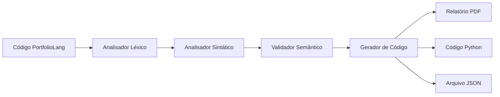

# 📊 PortfolioLang DSL

**Domain Specific Language para Configuração de Carteiras de Investimentos**

---

## 📋 Índice

- [📖 Sobre o Projeto](#-sobre-o-projeto)
- [🎯 Objetivos](#-objetivos)
- [🏗️ Arquitetura](#️-arquitetura)
- [⚙️ Instalação](#️-instalação)
- [🚀 Como Usar](#-como-usar)
- [📝 Sintaxe da Linguagem](#-sintaxe-da-linguagem)
- [🔧 Componentes Técnicos](#-componentes-técnicos)
- [📄 Geração de PDF](#-geração-de-pdf)
- [🧪 Exemplos](#-exemplos)
- [📊 Validações](#-validações)

---

## 📖 Sobre o Projeto

**PortfolioLang** é uma Domain Specific Language (DSL) desenvolvida para o trabalho de **Linguagens Formais e Compiladores** da **Universidade de Santa Cruz do Sul (UNISC)**, sob orientação do **Prof. Ivan L. Süptitz**.

A linguagem permite definir configurações de carteiras de investimentos de forma intuitiva e automatizar a geração de relatórios profissionais em PDF.

### 🎯 Características Principais

- ✅ **Sintaxe Simples**: Fácil de escrever e entender
- ✅ **Validação Semântica**: Verifica consistência automática
- ✅ **Geração de PDF**: Relatórios profissionais automatizados
- ✅ **Implementação Manual**: Lexer e parser construídos do zero
- ✅ **Multiplataforma**: Funciona em Jupyter, Colab, Python local

---

## 🎯 Objetivos

### 🎓 Acadêmicos
- Demonstrar conhecimento em **análise léxica e sintática**
- Implementar uma **gramática livre de contexto** completa
- Aplicar **validações semânticas** no domínio financeiro
- Gerar **saídas úteis** a partir do código processado

### 💼 Práticos
- Simplificar a configuração de carteiras de investimentos
- Automatizar validações de alocação e perfil de risco
- Gerar relatórios profissionais padronizados
- Facilitar análise e comunicação de estratégias de investimento

---

## 🏗️ Arquitetura



### 🔧 Componentes

1. **Analisador Léxico**: Converte texto em tokens
2. **Analisador Sintático**: Verifica estrutura gramatical
3. **Validador Semântico**: Garante consistência lógica
4. **Gerador de Código**: Produz saídas úteis

---

## ⚙️ Instalação

### 📋 Pré-requisitos
- Python 3.7+
- pip (gerenciador de pacotes)

### 🔨 Instalação Automática
O projeto instala automaticamente as dependências necessárias:

```bash
# Clonando o repositório (se aplicável)
git clone [URL_DO_REPOSITORIO]
cd portfoliolang-dsl

# Executando o código (instala dependências automaticamente)
python portfolio_dsl.py
```

### 📦 Dependências
- `reportlab`: Geração de PDFs
- `datetime`: Manipulação de datas (built-in)
- `json`: Serialização de dados (built-in)
- `os`: Operações de sistema (built-in)

---

## 🚀 Como Usar

### 1️⃣ Execução Básica

```python
# Importar a DSL
from portfolio_dsl import test_portfolio_dsl

# Executar teste automaticamente
success, result, generator = test_portfolio_dsl()
```

### 2️⃣ Processamento Manual

```python
from portfolio_dsl import PortfolioLexer, PortfolioParser, PortfolioValidator, PortfolioCodeGenerator

# Código da carteira
carteira_code = '''
carteira {
    nome = "Minha Carteira";
    perfil = "moderado";
    horizonte_temporal = 5 anos;
    
    alocação {
        ações_nacionais = 40%;
        renda_fixa = 60%;
    }
}
'''

# Processar
lexer = PortfolioLexer()
parser = PortfolioParser()
validator = PortfolioValidator()

# Análise
tokens = lexer.tokenize(carteira_code)
result = parser.parse(tokens)
is_valid = validator.validate(result)

# Gerar saídas
if is_valid:
    generator = PortfolioCodeGenerator(result)
    pdf_file = generator.generate_pdf_report()
    python_code = generator.generate_python_code()
```

---

## 📝 Sintaxe da Linguagem

### 🔤 Estrutura Básica

```
carteira {
    // Configurações obrigatórias
    nome = "Nome da Carteira";
    perfil = "conservador|moderado|arrojado";
    horizonte_temporal = NÚMERO anos|meses;
    
    // Alocação obrigatória
    alocação {
        ações_nacionais = NÚMERO%;
        ações_internacionais = NÚMERO%;
        fundos_imobiliarios = NÚMERO%;
        fundos_multimercado = NÚMERO%;
        renda_fixa = NÚMERO%;
    }
    
    // Seções opcionais
    restrições { ... }
    rebalanceamento { ... }
}
```

### 🎨 Tokens da Linguagem

#### Palavras-chave
```
carteira, nome, perfil, horizonte_temporal, alocação, 
restrições, rebalanceamento, ações_nacionais, 
ações_internacionais, fundos_imobiliarios, 
fundos_multimercado, renda_fixa
```

#### Símbolos
```
= (igual)
{ } (chaves)
; (ponto e vírgula)
% (percentual)
```

#### Literais
```
"string"        // Strings entre aspas
123 | 12.5      // Números inteiros ou decimais
identificador   // Identificadores válidos
```

### 📋 Gramática (BNF)

```bnf
programa ::= carteira

carteira ::= 'carteira' '{' configuracoes alocacao restricoes? rebalanceamento? '}'

configuracoes ::= configuracao configuracoes | configuracao

configuracao ::= 'nome' '=' STRING ';'
               | 'perfil' '=' STRING ';'
               | 'horizonte_temporal' '=' NUMERO ('anos'|'meses') ';'

alocacao ::= 'alocação' '{' lista_alocacoes '}'

lista_alocacoes ::= alocacao_ativo lista_alocacoes | alocacao_ativo

alocacao_ativo ::= tipo_ativo '=' NUMERO '%' ';'

tipo_ativo ::= 'ações_nacionais' | 'ações_internacionais' 
             | 'fundos_imobiliarios' | 'fundos_multimercado' | 'renda_fixa'
```

---

## 🔧 Componentes Técnicos

### 🔍 Analisador Léxico (`PortfolioLexer`)

**Responsabilidade**: Converter texto em tokens

**Características**:
- Implementação manual (sem PLY)
- Reconhecimento de 25+ tipos de tokens
- Tratamento de erros léxicos
- Suporte a caracteres especiais (ã, ç)

**Métodos Principais**:
```python
tokenize(text)          # Tokeniza o texto de entrada
read_string()           # Lê strings entre aspas
read_number()           # Lê números inteiros e decimais
read_identifier()       # Lê identificadores e palavras-chave
```

### 🔧 Analisador Sintático (`PortfolioParser`)

**Responsabilidade**: Verificar estrutura gramatical

**Técnica**: Recursive Descent Parsing

**Características**:
- Implementação manual da gramática
- Construção de AST (Abstract Syntax Tree)
- Ações semânticas integradas
- Tratamento de erros sintáticos

**Métodos Principais**:
```python
parse(tokens)           # Parse principal
parse_carteira()        # Parse da estrutura da carteira
parse_configuracoes()   # Parse das configurações
parse_alocacao()        # Parse da alocação de ativos
```

### ✅ Validador Semântico (`PortfolioValidator`)

**Responsabilidade**: Verificar consistência lógica

**Validações Implementadas**:
1. **Soma das alocações = 100%**
2. **Percentuais entre 0% e 100%**
3. **Consistência perfil vs. alocação**
4. **Restrições dentro de limites razoáveis**

**Exemplo de Validação**:
```python
# Perfil conservador com 80% em ações = ⚠️ Inconsistente
# Soma de alocação = 110% = ❌ Erro
# Volatilidade = 150% = ❌ Fora do intervalo
```

### ⚙️ Gerador de Código (`PortfolioCodeGenerator`)

**Responsabilidade**: Produzir saídas úteis

**Saídas Geradas**:
1. **PDF Profissional**: Relatório completo formatado
2. **Código Python**: Classe executável para análise
3. **JSON**: Configuração estruturada

---

## 📄 Geração de PDF

### 🎨 Características do PDF

- **📊 Cabeçalho**: Título profissional e data de geração
- **ℹ️ Informações Gerais**: Nome, perfil, horizonte temporal
- **💰 Tabela de Alocação**: Ativos, percentuais, classificação de risco
- **📈 Métricas Calculadas**: Exposição ao risco, diversificação
- **🔒 Restrições**: Volatilidade, taxas, limites setoriais
- **📊 Visualização**: Barras de distribuição em ASCII
- **💡 Recomendações**: Sugestões baseadas na análise
- **📝 Rodapé**: Informações do sistema e universidade

### 🛠️ Tecnologia Utilizada

- **ReportLab**: Biblioteca profissional para PDF
- **Tabelas Estilizadas**: Cores, bordas, alinhamento
- **Estilos Customizados**: Fontes, cores, espaçamento
- **Layout Responsivo**: Adapta-se ao conteúdo

### 📋 Exemplo de Conteúdo

```
📊 RELATÓRIO DE CARTEIRA DE INVESTIMENTOS

ℹ️ INFORMAÇÕES GERAIS
┌─────────────────────┬──────────────────────┐
│ Nome da Carteira    │ Carteira Executiva   │
│ Perfil de Risco     │ Moderado             │
│ Horizonte Temporal  │ 5 anos               │
└─────────────────────┴──────────────────────┘

💰 ALOCAÇÃO DE ATIVOS
┌─────────────────────┬──────────┬─────────────┐
│ Classe de Ativo     │ Percent. │ Classificação│
├─────────────────────┼──────────┼─────────────┤
│ Ações Nacionais     │ 30%      │ Alto Risco  │
│ Ações Internacionais│ 20%      │ Alto Risco  │
│ Fundos Imobiliários │ 15%      │ Baixo Risco │
│ Fundos Multimercado │ 10%      │ Alto Risco  │
│ Renda Fixa          │ 25%      │ Baixo Risco │
├─────────────────────┼──────────┼─────────────┤
│ TOTAL              │ 100%     │             │
└─────────────────────┴──────────┴─────────────┘
```

---

## 🧪 Exemplos

### 🟢 Carteira Conservadora

```portfoliolang
carteira {
    nome = "Carteira Aposentadoria";
    perfil = "conservador";
    horizonte_temporal = 15 anos;
    
    alocação {
        renda_fixa = 75%;
        fundos_imobiliarios = 20%;
        ações_nacionais = 5%;
    }
    
    restrições {
        volatilidade_maxima = 5%;
        taxa_administrativa_maxima = 1%;
    }
}
```

### 🟡 Carteira Moderada

```portfoliolang
carteira {
    nome = "Carteira Família";
    perfil = "moderado";
    horizonte_temporal = 8 anos;
    
    alocação {
        ações_nacionais = 35%;
        renda_fixa = 35%;
        fundos_imobiliarios = 20%;
        ações_internacionais = 10%;
    }
    
    restrições {
        volatilidade_maxima = 12%;
        taxa_administrativa_maxima = 2%;
    }
}
```

### 🔴 Carteira Arrojada

```portfoliolang
carteira {
    nome = "Carteira Growth";
    perfil = "arrojado";
    horizonte_temporal = 20 anos;
    
    alocação {
        ações_nacionais = 45%;
        ações_internacionais = 30%;
        fundos_multimercado = 15%;
        renda_fixa = 10%;
    }
    
    restrições {
        volatilidade_maxima = 25%;
        taxa_administrativa_maxima = 3%;
    }
}
```

### ❌ Exemplo com Erro

```portfoliolang
carteira {
    nome = "Carteira Erro";
    perfil = "moderado";
    horizonte_temporal = 5 anos;
    
    alocação {
        ações_nacionais = 60%;
        renda_fixa = 50%;
        // ❌ Soma = 110%, deveria ser 100%
    }
}
```

---

## 📊 Validações

### ✅ Validações Implementadas

#### 1. **Soma das Alocações**
```python
# ✅ Válido
total = 30% + 20% + 15% + 10% + 25% = 100%

# ❌ Inválido
total = 60% + 50% = 110%  # Erro: Soma incorreta
```

#### 2. **Intervalos Percentuais**
```python
# ✅ Válido
ações_nacionais = 30%  # Entre 0% e 100%

# ❌ Inválido
ações_nacionais = 150%  # Erro: Acima de 100%
renda_fixa = -10%       # Erro: Negativo
```

#### 3. **Consistência de Perfil**
```python
# Perfil conservador
if risk_exposure > 30%:
    ⚠️ "Alto risco para perfil conservador"

# Perfil arrojado  
if risk_exposure < 50%:
    ⚠️ "Baixo risco para perfil arrojado"
```

#### 4. **Restrições Razoáveis**
```python
# Volatilidade
if volatilidade < 5% or volatilidade > 25%:
    ⚠️ "Volatilidade fora da faixa normal"

# Taxa administrativa
if taxa > 3%:
    ⚠️ "Taxa administrativa alta"
```

### 🎯 Tipos de Resultado

- **✅ Sucesso**: Todas as validações passaram
- **⚠️ Avisos**: Inconsistências detectadas, mas processamento continua
- **❌ Erros**: Problemas que impedem o processamento

--